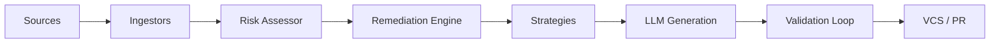

# Autonomous AI Auto-Fixer

The **Autonomous AI Auto-Fixer** is an enterprise-grade .NET 10 console application designed to automate the remediation of technical debt and security vulnerabilities. It integrates with **SonarQube**, **Mend**, and **Trivy** to ingest findings, generate validated code fixes using AI, and submit Pull Requests to **Azure Repos** and **GitHub**.

- [Configuration Guide](src/AutoFixer/CONFIGURATION.md)
- [Setup & Deployment Guide](src/AutoFixer/SETUP_AND_DEPLOYMENT.md)
- [Contributing Guide](CONTRIBUTING.md)
- [Playbook / Architecture](playbook.md)

## Current Progress
- [x] **Core Framework**: .NET 10 console app, YAML/env config, Serilog logging
- [x] **Ingestion**: SonarQube (API + file), Mend (API + file), Trivy (file) — JSON only for now
- [x] **Remediation Engine**: finding orchestration, validation loop with self-correction
- [x] **LLM Client**: Azure OpenAI chat-completions (with key/endpoint env-var fallback and transient-error retry)
- [x] **VCS Client**: GitHub REST API (branch create, file commit via Contents API, open PR)
- [x] **Validation**: Cross-platform linter shell-out (Windows `cmd`, Unix `/bin/sh`)
- [x] **Azure DevOps VCS client**: Azure DevOps Git REST API (branch create, push commits, open PR)
- [x] **SARIF ingestion**: Parse industry-standard `.sarif` JSON reports
- [x] **Multi-format ingestion** (PDF/Excel/CSV): `CsvIngestor` (CsvHelper), `ExcelIngestor` (ClosedXML), `PdfIngestor` (PdfPig) — all file-based with configurable column mapping and best-effort pattern extraction
- [x] **Build verification / CI integration**: Shell-based build verification (`ShellBuildVerificationService`) that applies patches locally, runs configured build commands (e.g. `dotnet build`), and restores original files
- [x] **Azure Key Vault secret source**: `ISecretProvider` abstraction with Azure Key Vault (`DefaultAzureCredential`), environment variable fallback, and composite provider
- [ ] **PR-comment feedback loop**: Not yet implemented

## Key Features
- **Autonomous Remediation**: Automatically fixes code smells, bugs, and dependency vulnerabilities using CodeSmell and Dependency strategies.
- **VCS Clients**: Robust integration with Azure DevOps and GitHub for PR management.
- **Risk Assessment**: Classifies findings into Low/High risk to ensure only safe changes are automated.
- **Multi-Tool Ingestion**: Unified ingestion from SonarQube and Mend (vulnerability and technical debt).
- **PR Monitoring**: Human-in-the-loop support via comment polling.
- **Dry-Run Mode**: Supports a "Report Only" mode for human approval before applying any fixes.
- **Enterprise-Grade Security**: Integrated with Azure Key Vault for secure credential management.
- **Modern .NET Platform**: Built on .NET 10 with async/await patterns and nullable reference types.

## Tech Stack

- **Framework**: .NET 10
- **Language**: C# 12+
- **Agent Orchestration**: Custom AI reasoning loops with async Task-based patterns
- **Runtime LLM**: GitHub Copilot / Claude Sonnet 4 via HTTP clients
- **VCS**: Azure DevOps REST API, GitHub REST API
- **Secrets**: Azure Key Vault, User Secrets, Environment Variables
- **Logging**: Serilog with console, file, and Application Insights sinks
- **Configuration**: JSON/YAML configuration with environment variable overrides
- **Testing**: xUnit, FluentAssertions, Moq
- **Infrastructure**: Containerized deployment (Docker/Kubernetes), Azure App Service, AKS

## Setup

### Prerequisites

- [.NET 10 SDK](https://dotnet.microsoft.com/download/dotnet/10.0) or later
- Access to Azure Key Vault (with appropriate secrets configured)
- VCS Credentials (PAT for Azure DevOps, GitHub App credentials)
- IDE: Visual Studio 2022 (v17.8+) or JetBrains Rider, VS Code with C# extension

### Installation

1. **Clone the repository**:
   ```bash
   git clone https://github.com/ndavat/autonomous-ai-auto-fixer.git
   cd autonomous-ai-auto-fixer
   ```

2. **Restore dependencies**:
   ```bash
   dotnet restore
   ```

3. **Build the solution**:
   ```bash
   dotnet build --configuration Release
   ```

4. **Configure the application**:
   - Copy `appsettings.json` to your environment-specific file (e.g., `appsettings.Development.json`)
   - Update configuration values or use environment variables (see [CONFIGURATION.md](CONFIGURATION.md))

5. **Run tests** (optional):
   ```bash
   dotnet test
   ```

## Usage

Run the autofixer in dry-run mode:
```bash
dotnet run -- --mode dry-run
```

Or publish and run as a standalone executable:
```bash
dotnet publish -c Release -o ./publish
./publish/AutoFixer --mode dry-run
```

Review the report and approve fixes:
```bash
dotnet run -- --mode fix --approve-all
```

### CLI Options

```bash
dotnet run -- --help
```

Common options:
- `--mode`: Operation mode (`dry-run`, `fix`, `report`)
- `--config`: Path to configuration file (default: `appsettings.json`)
- `--repo`: Target repository (org/repo format)
- `--branch`: Target branch for PRs
- `--input-file`: Path to input file for file-based ingestion
- `--approve-all`: Automatically approve all fixes (use with caution)
- `--verbose`: Enable verbose logging

For detailed CLI usage, see [SETUP_AND_DEPLOYMENT.md](SETUP_AND_DEPLOYMENT.md).

## Audit & Logging

The system maintains a tamper-proof audit log of all actions using Serilog, including:
- Ingested findings
- Generated prompts and LLM responses
- Validation results
- PR creation details

Logs can be output to console, files, or Azure Application Insights based on configuration.

---

## Architecture Overview

The Autonomous AI Auto-Fixer is built as a modular .NET pipeline:

1. **Ingestion Layer**: Fetches data from SonarQube (Clean Code), Mend (SCA), and Trivy (Container/SCM) via HTTP clients.
2. **Remediation Engine**: Processes, sorts, and classifies findings based on risk policy using async Task-based patterns.
3. **Strategy Layer**: Selects specific logic (CodeSmell, Dependency, Security) to apply fixes.
4. **AI Orchestration**: Uses GitHub Copilot / Claude Sonnet 4 via HTTP APIs to generate code and self-correct based on validation feedback.
5. **VCS Layer**: Manages Git operations and Pull Requests on Azure DevOps (Primary) and GitHub via REST APIs.



---

## Configuration & Ingestion

See [CONFIGURATION.md](CONFIGURATION.md) for complete configuration guide.

**API-Based Ingestion:**
- Configure SonarQube, Mend, and Trivy API details in `appsettings.json` or environment-specific files.
- Secrets (tokens/keys) are retrieved from Azure Key Vault, User Secrets, or environment variables.

**File-Based Ingestion:**
- Pass exported reports (JSON, PDF, Excel, CSV, SARIF) via the CLI `--input-file` flag.
- Place files in `data/inputs/` for automatic scanning.

**Repository Mapping:**
- The agent maps findings to repositories using metadata in reports or CLI flags.

**Environment Variables:**
- Override any configuration using double-underscore notation: `Section__Setting=value`
- Example: `Agent__Mode=fix`, `VCS__AzureDevOps__Organization=my-org`

---

## Deployment

See [SETUP_AND_DEPLOYMENT.md](SETUP_AND_DEPLOYMENT.md) for comprehensive deployment guide.

**Containerized:**
- Deploy on Azure Container Apps, AKS, or locally with Docker Compose.
- Use the provided `Dockerfile` and `docker-compose.yml`.
- Build and run: `docker-compose up -d`

**Publish for Production:**
```bash
# Windows
dotnet publish -c Release -r win-x64 --self-contained -o ./publish/win-x64

# Linux
dotnet publish -c Release -r linux-x64 --self-contained -o ./publish/linux-x64

# macOS
dotnet publish -c Release -r osx-x64 --self-contained -o ./publish/osx-x64
```

**Azure Deployments:**
- **App Service**: Deploy as a web app or container
- **Container Instances**: Quick container deployment
- **AKS**: Kubernetes orchestration for scale
- See [SETUP_AND_DEPLOYMENT.md](SETUP_AND_DEPLOYMENT.md) for detailed instructions

**CLI Usage:**
- Run locally after building or publishing.
- Example:
   ```bash
   dotnet run -- --mode dry-run --repo "my-org/my-repo" --branch "develop"
   dotnet run -- --mode fix --input-file "./manual_reports/mend_vulnerabilities.json" --repo "my-org/web-app"
   ```

**PR Workflow:**
- The agent creates PRs in Azure DevOps or GitHub with detailed descriptions and validation evidence.
- Human reviewers can comment on PRs; the agent will attempt to address feedback automatically.

---

## Testing & Verification

**Unit Tests:**
```bash
dotnet test --verbosity normal
```

**Dry-Run Safety:**
- Run in dry-run mode to preview changes without modifying code.

**Validation:**
- All fixes are validated with linters and optional CI build checks.
- Self-correction loop: If a fix fails validation, the agent retries with improved suggestions.

**PR Comment Interaction:**
- Human-in-the-loop: Reviewer comments on PRs are detected and can trigger automated follow-up commits.

---

## Contributing

1. Fork the repository
2. Create a feature branch (`git checkout -b feature/amazing-feature`)
3. Commit your changes (`git commit -m 'Add amazing feature'`)
4. Push to the branch (`git push origin feature/amazing-feature`)
5. Open a Pull Request

Please ensure all tests pass (`dotnet test`) and follow the existing code style.

---

## License

This project is licensed under the MIT License - see the LICENSE file for details.

---

## Support

For issues, questions, or contributions, please open an issue on the GitHub repository or contact the development team.
